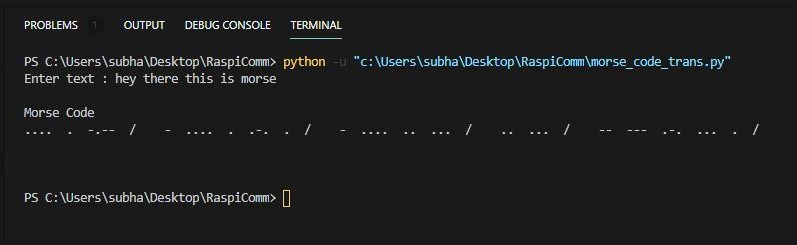

# RasComm

RasComm is a communication device that translates plain text into Morse code (IMC) visually or audibly.

## Morse Code
- Morse code is a way of communicating text as a series of on-off tones, lights, or clicks. The standard one used around is the International Morse Code (IMC). IMC consists of the Latin alphabet (A-Z), Arabic numerals (0-9), some punctuation, and procedural signals.
- Each IMC symbol is represented by a unique sequence of short and long signals called “dots” (.) and “dashes”(-).

### Rules
- A dot duration is the basic unit of time measurement in code transmission (.)
- A dash duration is 3x the dot duration (–)
- Each dot or dash is followed by a short silence, equal to the dot duration
- Letters in a word are separated by a gap equal to 3 dots
- Words are separated by a gap equal to 7 dots

### International Morse Code

### Working
The application first converts the plain text into morse code with dots and dashes by mapping each letter or symbol to the IMC codes. Then the dots and dashes are transmitted audibily or visually with the help of piezo electric speaker or LED that is attached to the raspberry pi. Then routines for the GPIO pins are written that execute to create dot and dashes and the time gap between the words. The base time can be adjusted so that we can either increase or decrease the speed of transmission of message.

## Application

### Demo

VISUAL

AUDIO (Click to watch video)

